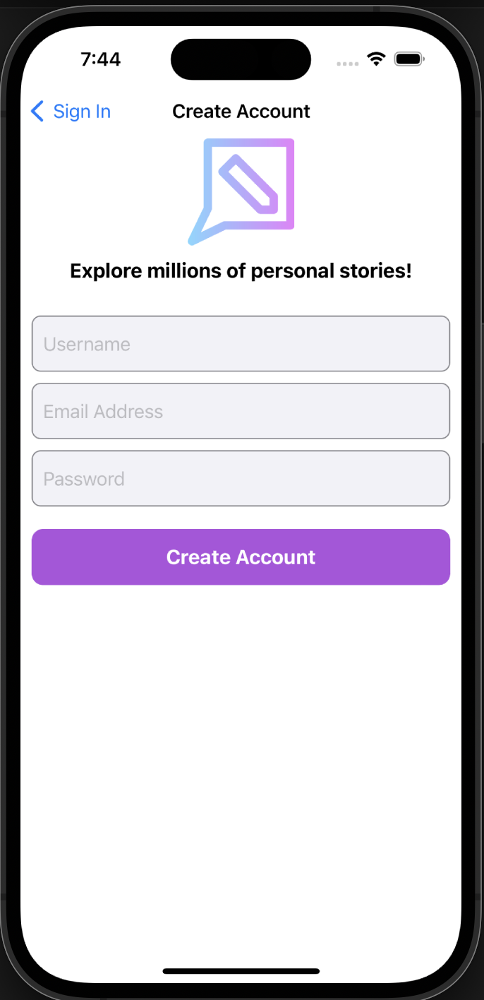
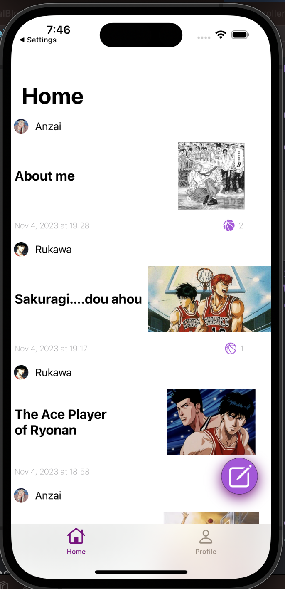
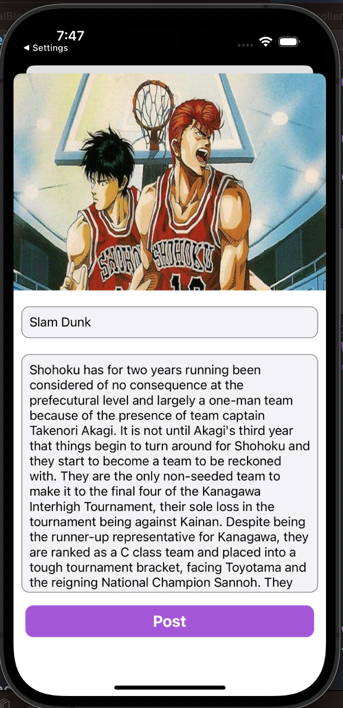
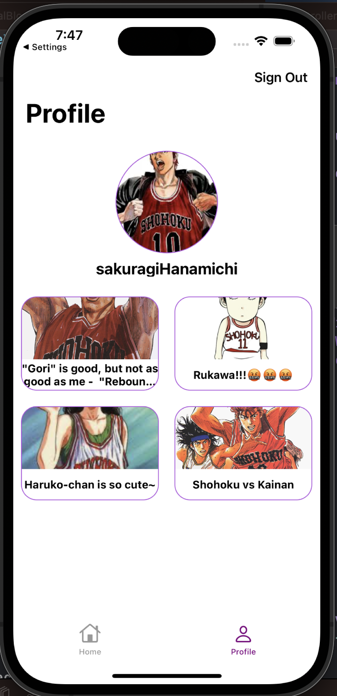
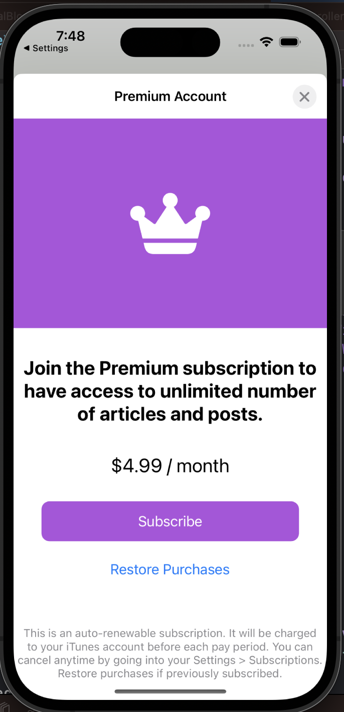
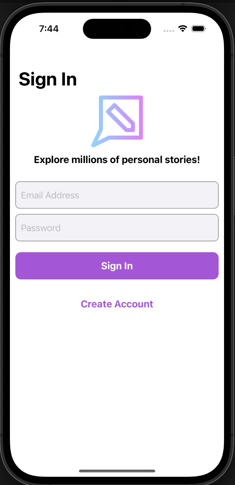
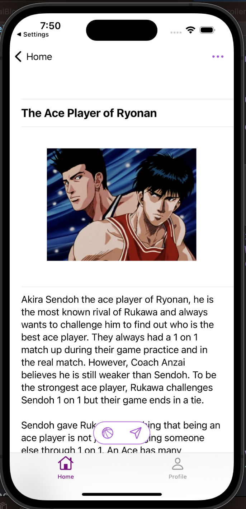

# Swift-UIkit-Projects

This repository contains a collection of projects built using SwiftUI. Each project showcases different features and functionalities implemented using SwiftUI. A repo with the same projects, but with UIKit is [here](https://github.com/hyonbokan/Swift-UIkit-Projects)

## Projects

### 1. ToDoList

**ToDoList** is a task management application that allows users to efficiently manage their daily tasks. 

#### Key Features:

- **User Authentication**: Users can easily register and log in to the app. Authentication is securely handled using Firebase Auth.
  
- **Task Management**: 
  - **Add Tasks**: Users can add tasks to their list, specifying the title, date, and exact time for each task.
  - **Delete Tasks**: Any task can be removed from the list with a simple action.
  - **Task Completion**: Tasks can be marked as completed once they are done.
  
- **Backend**: The backend of the app is powered by Firebase. All data is stored and fetched in real-time from Firebase Firestore.

### 2. Airbnb

**Airbnb** offers a simplified version of the popular Airbnb platform. This project was designed to provide a hands-on learning experience, focusing on API integration, data modeling, and creating a user interface using SwiftUI.

#### Key Features:

- **API Integration**: In this project, we delve into the world of APIs and learn how to interact with external data sources. We utilize the Airbnb API, which is sourced from [OpenDataSoft](https://public.opendatasoft.com/explore/dataset/airbnb-listings/table/?disjunctive.host_verifications&disjunctive.amenities&disjunctive.features), to fetch scrapped data for Airbnb listings.

- **Data Modeling**: A fundamental aspect of this project is creating and defining structures for Airbnb listings.

- **User Interface**: The app presents a list of Airbnb listings in New York, providing essential information such as photos, listing details, and host information.

### 3. Personal Blog

  
  
   
  
  
  
  

