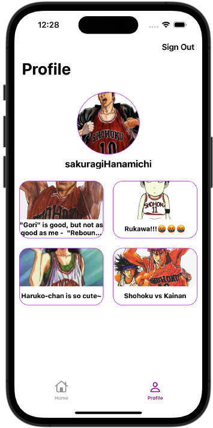

# Swift-UIkit-Projects

This repository contains a collection of projects built using SwiftUI. Each project showcases different features and functionalities implemented using SwiftUI. A repo with the same projects, but with UIKit is [here](https://github.com/hyonbokan/Swift-UIkit-Projects)

## Projects

### 1. ToDoList

**ToDoList** is a task management application that allows users to efficiently manage their daily tasks. 

#### Key Features:

- **User Authentication**: Users can easily register and log in to the app. Authentication is securely handled using Firebase Auth.
  
- **Task Management**: 
  - **Add Tasks**: Users can add tasks to their list, specifying the title, date, and exact time for each task.
  - **Delete Tasks**: Any task can be removed from the list with a simple action.
  - **Task Completion**: Tasks can be marked as completed once they are done.
  
- **Backend**: The backend of the app is powered by Firebase. All data is stored and fetched in real-time from Firebase Firestore.

### 2. Airbnb

**Airbnb** offers a simplified version of the popular Airbnb platform. This project was designed to provide a hands-on learning experience, focusing on API integration, data modeling, and creating a user interface using SwiftUI.

#### Key Features:

- **API Integration**: In this project, we delve into the world of APIs and learn how to interact with external data sources. We utilize the Airbnb API, which is sourced from [OpenDataSoft](https://public.opendatasoft.com/explore/dataset/airbnb-listings/table/?disjunctive.host_verifications&disjunctive.amenities&disjunctive.features), to fetch scrapped data for Airbnb listings.

- **Data Modeling**: A fundamental aspect of this project is creating and defining structures for Airbnb listings.

- **User Interface**: The app presents a list of Airbnb listings in New York, providing essential information such as photos, listing details, and host information.

### 3. Personal Blog
**PersonalBlog** is an interactive mobile app that allows users to craft and share their stories through a combination of text and images.

#### Demo:

  
  
   
  
  
  
  
  

## Key Features

- User authentication
- Real-time database interactions
- Image, post uploads
- Post like status and updates
- Custom collection and table view cells
- MVVM Design Pattern

In the development of **PersonalBlog**, I put a strong emphasis on refining the user experience and implementing advanced customizations. 
- **Concurrent User Retrieval**: I utilized DispatchGroup to coordinate concurrent operations. Inside this group, the app first fetches all user data from the data, and the defer statement ensures that it exits the group once the user data is obtained.

- **Parallel Post Retrieval**: To maximize performance, I used Swift's `DispatchG` construct. This allows us to fetch posts for each user in parallel, reducing the overall time required to obtain the necessary data. 

- **Efficient View Model Creation**: We also leverage asynchronous tasks to create view models for each post. This approach ensures that the UI remains responsive, even when dealing with a large number of posts.

- **UI Update on the Main Queue**: To maintain a seamless user interface, we wisely use `DispatchQueue.main.async` to update the UI on the main queue once all asynchronous tasks have completed. This ensures that the user sees the most up-to-date content without any delays or interruptions.

By implementing these advanced asynchronous data retrieval techniques, we've optimized the performance of our app, providing users with a smoother and more responsive experience when interacting with their blog posts and content. This is just one example of how we've prioritized efficiency and user satisfaction in our project.
